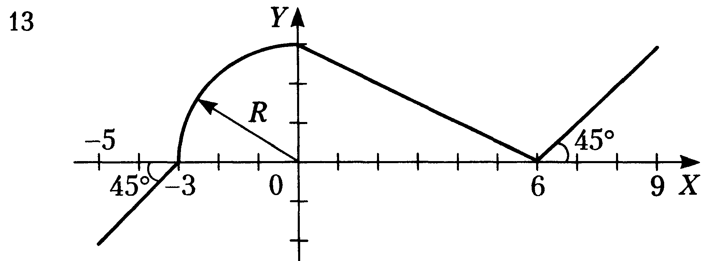

# Лабораторная 1
## Циклическое вычисление значений функции
### Для x -10 до 10 вычислены значения y, созданы функции line и circle, функция way их обобщает и возвращает значение y для заданного графика

